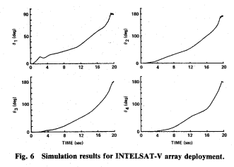
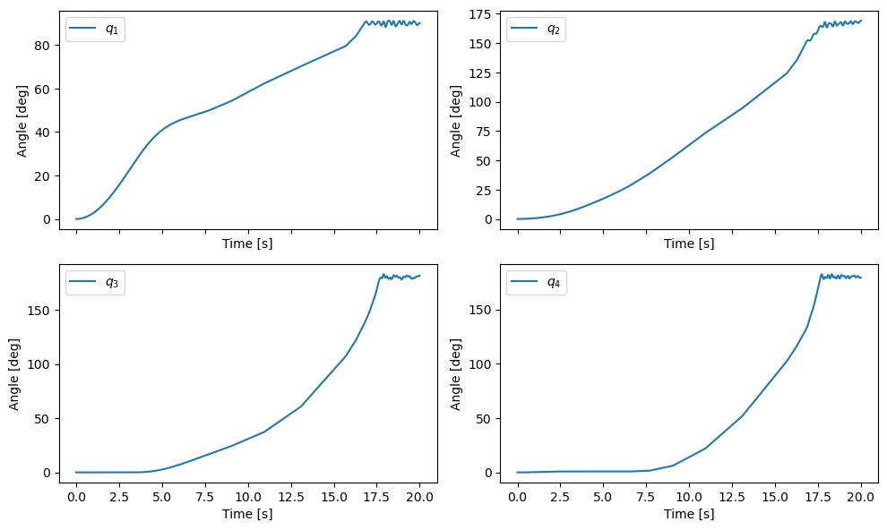
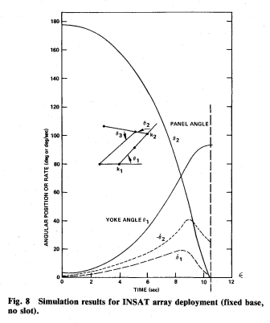
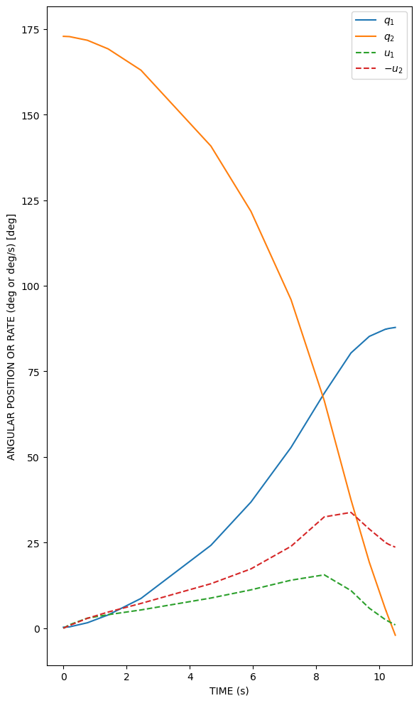
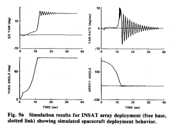
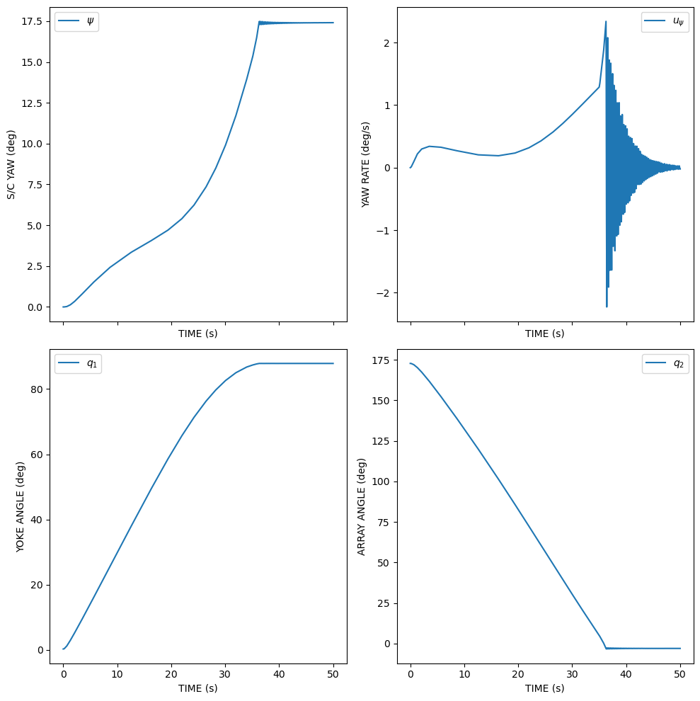

# 🚀 Spacecraft Solar Array Deployment Dynamics using Kane’s Method

This project reproduces key results from the paper: 

> **Modeling and Simulation of Spacecraft Solar Array Deployment**  
> Wie, B., Furumoto, N., Banerjee, A. K., & Barba, P. M. (1986)

The implementation follows exercises from the book:

> **Space Vehicle Dynamics and Control** — B. Wie

---

## 🧠 Methodology

- Derivation of equations of motion using both **Lagrange's method** and **Kane’s method** (SymPy)
- Numerical integration using **SciPy ODE solvers**
- Validation through comparison with published results

---

## 📊 Reproduced Results

The following figures from the paper are reproduced using the corresponding exercises:

- **Figure 6 (INTELSAT-V deployment)**  
  → Reproduced using *Exercise 1.27*

- **Figure 8 (INSAT planar model)**  
  → Reproduced using *Exercise 1.28a*

- **Figure 9a (INSAT free-base with slotted link)**  
  → Reproduced using *Exercise 1.28b*

---

## 🧠 Technical Highlights

- Multibody dynamics with:
    - Tree topology (INTELSAT)
    - Closed-loop constraints (INSAT)
- Symbolic → numerical pipeline
- Handling:
    - Nonlinear coupling
    - Constraint forces
    - Switching dynamics (slotted link)

---

## 🛠️ Stack

- Python
- SymPy (Kane’s equations)
- SciPy (integration)
- NumPy / Matplotlib

---

## ▶️ How to Run

Create and activate a virtual environment on Windows, then install the required dependencies:

```bash
python -m venv test_env
test_env\Scripts\activate
pip install -r requirements.txt
```

## Running the notebooks

With the virtual environment activated, launch Jupyter:

```bash
jupyter notebook
```

This will open Jupyter in your default web browser. From there, navigate to the repository folder and open any `.ipynb` notebook.

---

## 📊 Results

<div align="center">
  
  
  <p>
    <em>Left: Original Figure 6 | Right: Reproduced result</em>
  </p>
</div>

<div align="center">
  
  
  <p>
    <em>Left: Original Figure 8 | Right: Reproduced result</em>
  </p>
</div>

<div align="center">
  
  
  <p>
    <em>Left: Original Figure 9a | Right: Reproduced result</em>
  </p>
</div>

---

## 🛰️ Contact

If you have questions or want to collaborate, feel free to reach out:
**Tomás Suárez**
Mechatronics Engineering Student
📧 [suareztomasm@gmail.com](mailto:suareztomasm@gmail.com)